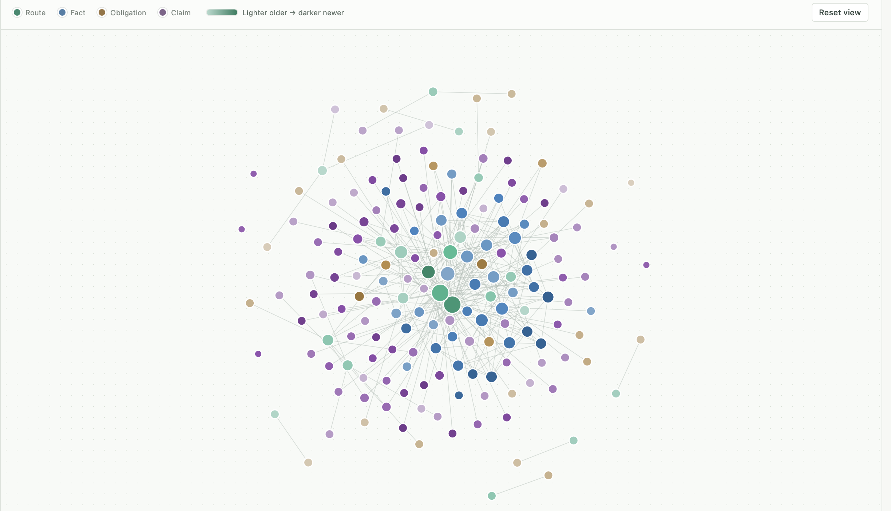

# Franta

[中文说明](README.zh-CN.md)

Remark. If you have any question regarding to anything listed in this repository, please contact the author:<br>
Yuan Lu<br>
ETH Zürich<br>
yuan.lu@math.ethz.ch<br>
yuan171003@outlook.com<br>

Franta is a recoverable multi-agent scheduler for long-running mathematical
research. It coordinates a main agent, research workers, a trimmer, fact
verifiers, and a synthesizer through the Codex CLI. The scheduler alone writes
canonical memory; agents submit proposals and evidence through scoped tools.

Optional Explorer turns collect provisional ideas before integration into
Franta memory. An optional Advisor proposes the next research subproblems and
waits for a human selection. A local dashboard displays progress, memory,
model usage, and feedback requests.

## Statement

Franta is an autonomous agent for mathematical research and exploration. The developer believes Franta is most valuable when it is used to support mathematical exploration and to help people understand and communicate mathematics, instead of replacing them.

## Requirements

| Component | Requirement |
| --- | --- |
| Python | 3.11 or newer; no third-party Python runtime dependencies |
| Operating system | macOS or Linux; native Windows is not supported because the runtime uses POSIX locking and Unix sockets. Windows users need a Linux environment such as WSL. |
| Codex CLI | Required for live research; authenticated access to the configured models and compatible CLI flags |
| SageMath / Macaulay2 | Optional, installed separately and enabled in the manifest |
| Tectonic | Optional, for compiling the trimmer's human-guidance PDF reports |
| CAS/report sandbox | macOS uses `sandbox-exec`; Linux requires `bubblewrap` (`bwrap`) and permission to create user namespaces |

Installing and testing the Python package does not require Codex, a model
account, or a computer algebra system. Live research does use the configured
account and its model usage allowance. Linux support includes a confinement
implementation; actual availability also depends on the host's sandbox policy.

## Install from GitHub or a ZIP

Clone this repository using its GitHub URL, or download **Code → Download ZIP**
and extract it. In the directory containing `pyproject.toml`, run:

```sh
python3 -m venv .venv
. .venv/bin/activate
python -m pip install .
franta --help
```

Use `python -m pip install -e .` instead for development. The distribution name
is `franta-research`; the command and import name are `franta`. These instructions
install the local source and do not assume a package has been published to PyPI.
Package installation includes the agent skill documents and dashboard assets.

Without installation, commands can also run from the source directory:

```sh
PYTHONPATH=src python3 -m franta.cli --help
sh bin/franta --help
```

Install the Codex CLI using the [official installation instructions](https://learn.chatgpt.com/docs/codex/cli).
Then authenticate in the same shell account used to run Franta:

```sh
codex --version
codex -c 'cli_auth_credentials_store="file"' login
codex login status
```

Franta creates a private Codex home for research and copies an existing
`auth.json` from `CODEX_HOME`, or from `~/.codex` when unset. File-based login
therefore works with this isolation mechanism; a login stored only in an OS
keyring is not copied. Host Codex configuration, skills, and plugins are not
imported. See [OpenAI's authentication documentation](https://learn.chatgpt.com/docs/auth)
for API-key and headless login options.

## First project

Copy the examples to a separate working directory so research data stays
outside the source checkout:

```sh
mkdir -p ../franta-work/config
cp examples/bootstrap.toml examples/root-problem.md examples/foundation.md ../franta-work/config/
```

Edit the copied `root-problem.md` to state your mathematical problem, and
`foundation.md` to define allowed assumptions and proof standards. Edit
`config/bootstrap.toml` to choose the project name, output directory, and tools.
Paths in the manifest are relative to its own directory. With the example's
`directory = "../example-project"`, the following creates
`../franta-work/example-project`:

```sh
franta init ../franta-work/config/bootstrap.toml
franta status ../franta-work/example-project
```

These two commands create and inspect local state without launching models.
After checking authentication and model access, start research:

```sh
franta start ../franta-work/config/bootstrap.toml
```

The foreground process runs until completion, a durable human/attention pause,
quiescence, or interruption. After `Ctrl-C` or a stopped run, continue with:

```sh
franta resume ../franta-work/example-project
```

`resume` uses persisted state and recovers interrupted work. Configuration is
frozen at initialization: editing the original manifest does not reconfigure
an existing project, and `start` rejects a changed manifest for the same project.
Choose a new project directory when changing research configuration.

This Franta release is intended for new projects. Persisted names and schemas
have changed since earlier internal versions, and no migration tool is
provided. Do not use this release to resume historical research directories;
retain the matching original program for those runs.

## Tools and models

Optional tools are disabled when omitted. Enable only tools installed on your
machine, using executable names on `PATH`:

```toml
[tools]
codex = "codex"
sage = "sage"
macaulay2 = "M2"
tectonic = "tectonic"
```

Absolute paths, `~/...`, and manifest-relative executable paths are also
supported. A value names one executable, not a shell command. For installation
links, environment wrappers, Linux confinement, and Tectonic cache preparation,
see [tool configuration](docs/USAGE.md#tools-and-confinement).

The shipped research routes use `gpt-6-astra`: main/trimmer/verifier routes
default to `ultra`, the synthesizer to `xhigh`, workers and Explorer to `max`,
and the main sorter and Advisor to `ultra`. Main/default and synthesizer settings can be specified
in the manifest; some routes remain fixed in code. These are this project's
settings, not a promise that every account or Codex build can use them. The
transport also sets a context window of `872000` and auto-compaction threshold
of `780000`. Verify compatibility before a long run. See the
[model configuration details](docs/USAGE.md#models-and-runtime-compatibility).

## Explorer, Advisor, and the dashboard

Add the following to a **new** manifest to enable alternating Explorer and
Franta turns followed by human selection of the next focus:

```toml
[explorer]
enabled = true

[advisor]
enabled = true
```

The sequence is `Explorer → Franta → Advisor → Explorer → …`. Advisor requires
Explorer; Explorer can run without Advisor. Omit a table to disable that
subsystem. The example manifest documents timing and concurrency settings.

Explorer refills worker slots independently: when an attempt finishes, that
Explorer can start its next attempt without waiting for peers. Once it has
finished all planned attempts, a new Explorer can take its slot while admission
remains open. After admission closes, existing Explorers finish their remaining
attempts before the handoff to Franta.

Each phase stops admitting new tasks after 20 Explorer or 30 Franta worker
attempts by default. Existing tasks finish their remaining attempts and
postprocessing, so the final count can exceed the threshold. The dashboard
overview shows the counts and lets you change both limits; the latest saved
edit takes effect after 120 seconds and survives a runner restart.

Advisor proposes five obligations, then pauses research until you choose one
or two. Obtain the request and obligation IDs from `franta status PROJECT` or
the dashboard. For example:

```sh
franta advisor-feedback PROJECT REQUEST_ID \
  '{"choices":[{"kind":"listed","obligation_id":"OBLIGATION_ID"}],"instructions":"Focus on this obligation."}'
franta resume PROJECT
```

You can also send research suggestions while a project is running:

```sh
franta suggest PROJECT "Try reducing the problem to the relative case."
franta suggest PROJECT @/path/to/guidance.md
```

`start` and `resume` start or reuse a local dashboard and print its actual URL.
The default port is `1113`, incremented if occupied. Use `--no-dashboard` to
disable automatic startup, `--dashboard-port PORT` to choose a starting port,
or `franta dashboard PROJECT --port PORT` to open it separately.

The dashboard binds to `127.0.0.1`. Reading memory pages does not invoke a
model. Manual summary refresh and automatic refresh every 90 minutes during
active or human-feedback states invoke a separate read-only model call and
display its usage. Details are in the [operator guide](docs/USAGE.md).

## Tests and release preparation

Run the automated suite and the read-only evaluation fixture from the source
directory:

```sh
PYTHONPATH=src python3 -m unittest discover -s tests -v
PYTHONPATH=src python3 -m franta.evaluation \
  --snapshot evals/fixtures/complete_observation.json
```

The suite exercises deterministic scheduling, persistence, recovery, isolation,
transport contracts, and optional subsystems without requiring a live model.
Live Codex probes are separate and require an authenticated account; see
[evaluation instructions](evals/README.md) and [live probe instructions](evals/LIVE_AGENT_PROBES.md).
Passing offline tests does not establish live model access or prove the
mathematical correctness of a research result.

For building source/wheel distributions and preparing a clean GitHub upload,
see [publishing instructions](docs/PUBLISHING.md). Keep generated projects
private: they contain research transcripts and may contain copied credentials.

## Repository guide

| Path | Purpose |
| --- | --- |
| `src/franta/` | Scheduler, canonical memory, execution gateway, CLI, and host adapters |
| `src/explorer_system/` | Portable provisional exploration subsystem; [integration guide](src/explorer_system/README.md) |
| `src/advisor_system/` | Portable human-selected research planning; [integration guide](src/advisor_system/README.md) |
| `src/dashboard_system/` | Local UI and read-only monitor; [integration guide](src/dashboard_system/README.md) |
| `.agents/skills/` | Source skill documents included in packaged runtime assets |
| `examples/` | Bootstrap manifest and small input examples |
| `tests/`, `evals/` | Automated regressions and read-only evaluation tools |
| `Design.md`, `IMPLEMENTATION.md` | Research workflow specification and implementation decisions |

## License

The current package metadata identifies the project as **Proprietary**. No
open-source license is granted by this repository; obtain the author's
permission for uses requiring a license. Third-party dashboard assets retain
their own notices and licenses in [the vendor directory](src/dashboard_system/static/vendor/NOTICE.md).

## Example

In one example, Franta solved an open problem in mathematics, 900.74M research tokens, 51 agent attempts, and spending 38.26 hours. It also implemented its own python programs for mathematical computation. The result is an 34 page mathematical research paper that is currently under human verification and understanding.


